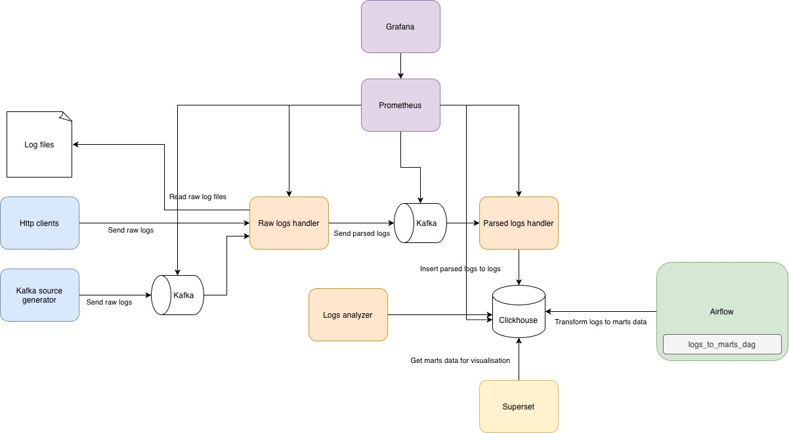

# Система сбора логов

## Введение

### Описание проекта

Система для сбора и анализа логов из различных источников: файлы, http, kafka и различных форматов: json, syslog, clf.

### Стек технологий

    &nbsp;
    &nbsp;
    &nbsp;
    &nbsp;
    &nbsp;
    &nbsp;
    &nbsp;
    &nbsp;
    &nbsp;
    &nbsp;

## Запуск

Проект запускается одной командой: `docker-compose up -d`. 
В рамках деплоймента будут развернуты и инициализированы все необходимые базы данных, сервисы, kafka, airflow и superset.

## Основная часть

### Анализ предметной области

- Архитектура решения выбрана таким образом, чтобы быть максимально отказоустойчивой и масштабируемой
- Как правило для аналогичных решений используется ELK: ElasticSearch, Logstash, Kibana. Иногда бывают самописные решения, например, на основании clickhouse

### Проектирование

#### Архитектура системы

- Нагрузочное тестирование показало, что весь деплоймент можно поднять с запасом на машине: 6 ядер по 3.2GHz, 8 GB RAM при 100RPS на запись логов в систему. 
- Размеры требуемого жесткого диска зависят от длительности хранения логов.

Архитектурная схема приложения:

Описание компонентов системы:
1. Сервисы
    - `raw-logs-handler`(Logly.RawLogsHandler) является входной точкой в систему сбора и анализа логов 
      - Занимается обработкой "сырых" логов в форматах json, syslog, clf. 
      - В качестве источников умеет работать с логами:
        - Посланными через http метод
        - Посланными через `kafka`
        - Записанными в файлах: `.txt`, `.csv`, `.log`, `.json`. Примеры файлов представлены в папке `infrastructure/log-files`
    - `parsed-logs-handler`(Logly.ParsedLogsHandler) сохраняет структурированные логи в `clickhouse`
    - `logs-analyzer`(Logly.LogsAnalyzer) предоставляет метод для фильтрации логов по параметрам
    - `logs-generator`(Logly.LogsGenerator) вспомогательный сервис для генерации логов, отправляет их в `kafka`
2. Инфраструктура
    - `kafka` используется для асинхронной отправки "сырых" логов в топик `logs.raw`, а также для отправки логов после парса и обработки в `raw-logs-handler` в топик `logs.parsed`. UI доступен [тут](http://localhost:8123)
    - `clickhouse` используется как хранилище для всех логов и агрегированных данных для дашбордов. UI доступен [тут](http://localhost:8123), логин: default, пароль: default
      - Автоматически создается одна БД – `logly` и все необходимые таблицы при запуске docker-compose. [Файл](infrastructure/clickhouse/init/001_schema.sql) для инициализации таблиц
      - В таблице `logs` лежат все логи в структурированном формате
      - В таблицах `metrics_*` хранятся агрегированные данные для построения дашбордов в `superset`
      - В таблице `service_last_seen` хранится информация про то, когда сервис последний раз писал логи. Также используется в `superset`
3. Мониторинг
    - `prometheus` используется для сбора метрик в сервисах. Каждый сервис предоставляет роут `metrics`, в ответе которого содержатся базовые метрики(`http`, `runtime`)
    - `grafana` используется для отображения метрик
4. Аналитика
    - `airflow` используется для сбора агрегированных метрик каждую минуту с помощью [dag](dags/logly_metrics_dag.py). UI доступен [тут](http://localhost:8123), логин: admin, пароль: admin
      - Работа dag для метрик

      
    - `superset` используется для отображения аналитических дашбордов. UI доступен [тут](http://localhost:8088/superset/welcome/), логин: admin, пароль: admin
      - Пример дашбордов

      

#### Схемы баз данных

[DBML-схемы](https://dbml.dbdiagram.io/home/) **всех** таблиц во **всех** используемых базах данных

### Тестирование

- Код сервисов покрыт модульными тестами.
  - Отчет о покрытии

  

## Заключение

### Выводы

В результате была реализованная полноценная масштабируемая отказоустойчивая система для сбора логов и сбора, отображание аналтических данных по ним

Система способна выдерживать высокие нагрузки – десятки тысяч РПС, поскольку может горизонтально масштабироваться

### Перспективы развития

Можно добавить большее количество типов файлов и форматов логов, а также перенести развертывание в k8s